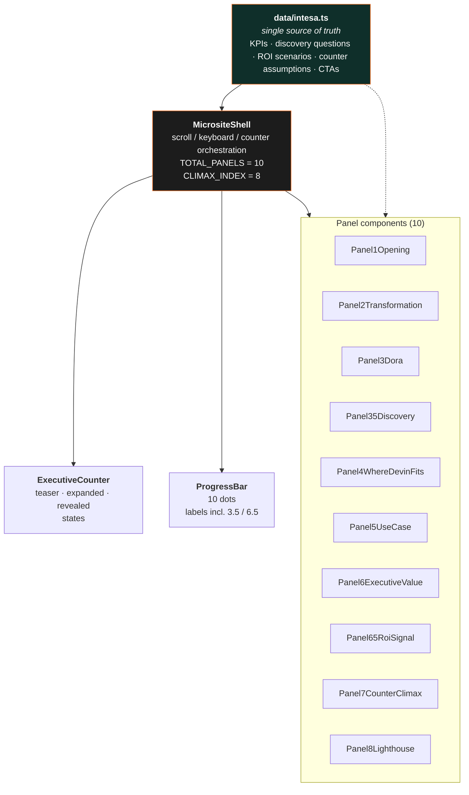

# Architecture

Next.js 14 (App Router) + Tailwind CSS + Framer Motion. Static export capable (`output: "export"` in `next.config.mjs` for deploys).

## Module layout



## Key invariants

| Invariant | Where enforced | Why |
|---|---|---|
| `TOTAL_PANELS = 10` | `MicrositeShell.tsx` | Determines scroller width (`10 × 100vw`) and keyboard bounds. |
| `CLIMAX_INDEX = 8` | `MicrositeShell.tsx` | Decouples narrative numbering (Panel 7 = climax) from render index (8th tile once the two `.5` interstitials are in). Drives counter reveal, expansion, and the final 8–18 clamp. |
| Panel 1 CTA `Open lighthouse` → `target: 10` | `intesa.ts` | 1-indexed CTA target. `goTo(10 − 1) = goTo(9)` = `Panel8Lighthouse`. |
| Space is **not** swallowed on `BUTTON` / `A` | `MicrositeShell.tsx` keydown handler | A11y: Space natively activates focused buttons. |
| Wheel wrapper `data-allow-native-scroll` only on actually-nested-scrollable elements | `Panel35Discovery.tsx` | Avoid disabling the desktop wheel → horizontal-scroll translation for the entire panel surface. |

## Responsive behaviour

| Viewport | Layout | Nav gestures |
|---|---|---|
| `≥ 768 px` | Horizontal snap-scroll, 10 full-screen tiles. | Arrows / PgUp / PgDn / Space / Home / End / progress-bar clicks / mouse wheel (translated to horizontal). |
| `≤ 767 px` | Vertical snap-stack, 10 stacked tiles. | Native vertical swipe / progress-bar taps / keyboard. |

Breakpoint: `MOBILE_MAX_WIDTH = 767` in `MicrositeShell.tsx`, synced with Tailwind's `md` breakpoint.

## Build & deploy

```bash
# local dev
cd intesa-microsite
npm install
npm run dev     # http://localhost:3000

# lint + typecheck
npm run lint

# production build
npm run build

# static export (for devinapps.com / any static host)
# temporarily set `output: "export"` in next.config.mjs, then
npm run build   # produces out/
```

## Testing / regression hot-spots

- **Counter math across 10 panels**: `useMemo` aggregates `visited` → `addMin/addMax`. Final clamp only runs after `visited.has(CLIMAX_INDEX)`.
- **CTA target drift** whenever a new interstitial is inserted. See commit [`a333df7`](https://github.com/sartan83/DevinTest/commit/a333df7).
- **Desktop wheel scroll**: the wheel handler early-returns if any ancestor up to the scroller has `data-allow-native-scroll="true"`. Apply this attribute narrowly.
- **Keyboard focus edge cases**: input fields / content-editable are skipped; `BUTTON` / `A` get native Space/Enter. Anything else routes to panel navigation.
