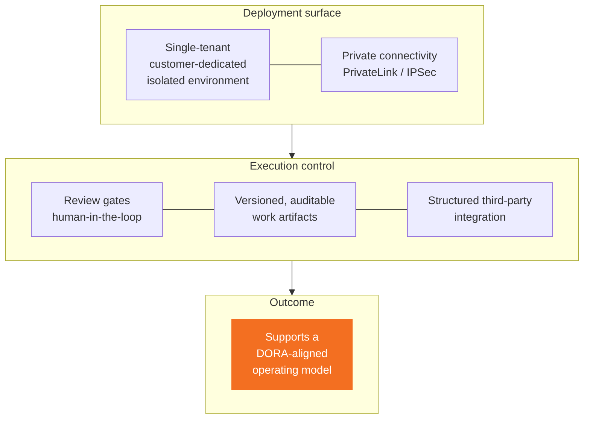

# Compliance framing

Everything in the microsite is phrased for a Tier-1 EU bank inside a DORA-aware operating model. Language is **deliberately precise** — mis-phrasing on this is more damaging than a weak number.

## Governance envelope

## DO / DO NOT

### DO say

- "Customer-dedicated isolated environment"
- "Single-tenant deployment"
- "Private connectivity (PrivateLink / IPSec)"
- "Human-in-the-loop"
- "Review gates"
- "Versioned, auditable work"
- "Supports a DORA-aligned operating model"
- "Structured third-party integration"

### DO NOT say

- ~~"On-prem"~~ → use "customer-dedicated isolated environment" or "single-tenant deployment"
- ~~"DORA compliant"~~ → DORA compliance is the bank's posture, not a vendor's certification. Use "supports a DORA-aligned operating model"
- ~~"Fully autonomous"~~ → undermines the review-gate / human-in-the-loop story
- ~~"AI that replaces developers"~~ → positioning is *execution engine*, not replacement

## Positioning frame (always)

| Devin is | Devin is NOT |
|---|---|
| An **execution engine** for modernization | An autonomous coding system |
| An **accelerator** for the engineering backlog | A replacement for engineers |
| A **controlled, reviewable delivery layer** | An opaque generator |
| **Support** for DORA-aligned operating models | A compliance product |

## Where this shows up in the microsite

| Panel | Where compliance language lives |
|---|---|
| **3 · DORA-aware** | 4 cards: Controlled change, Traceability, Isolated deployment, Risk governance. Closing: *"Devin operates within control frameworks, not outside them."* |
| **3.5 · Discovery** | `Risk` persona block asks about audit evidence and conditions for 2× change volume. |
| **4 · Where Devin fits** | Surfaces are bounded modernization work — not "everything an engineer does". |
| **5 · Use case** | Workflow ends in *review → PR*, not in merge. Human-in-the-loop preserved. |
| **6.5 · ROI signal** | Disclaimer: *"Illustrative model, not a commitment."* Safety margin explicit. |
| **8 · Lighthouse** | 30-day scoped engagement with readout — not open-ended rollout. |

## Source of language

All guardrail language is centralized in [`intesa.ts`](https://github.com/sartan83/DevinTest/blob/devin/1776884377-intesa-executive-microsite/intesa-microsite/src/data/intesa.ts). Code review should flag any string that violates the DO / DO NOT list above.
