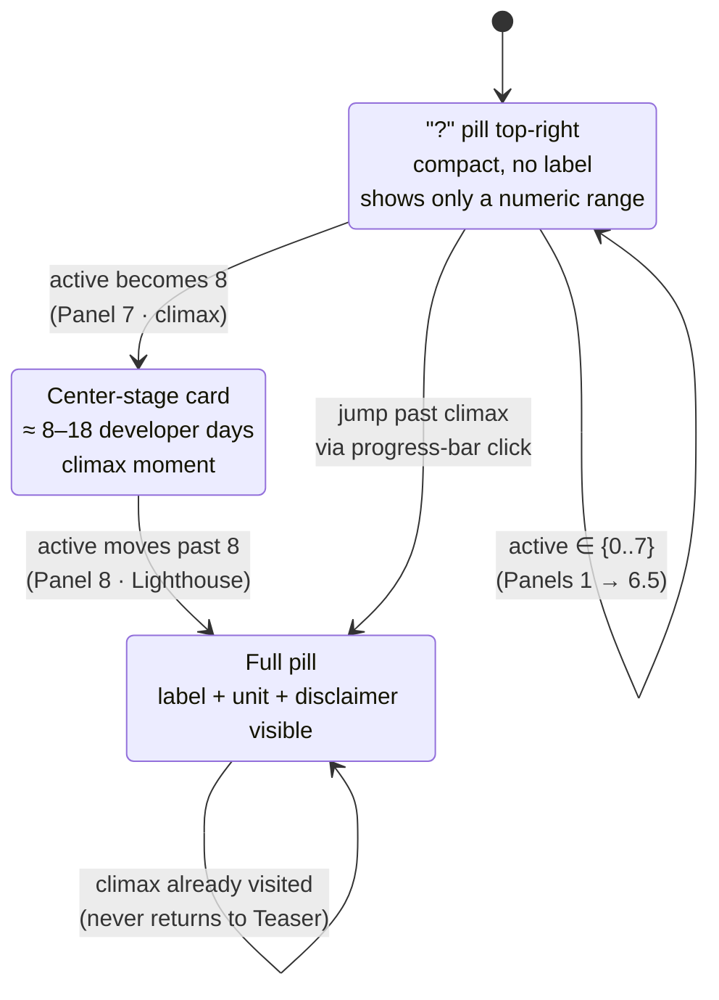

# Counter state

The persistent top-right module is a **teaser → reveal** component. Early panels show only a mysterious `?` pill. The full label and unit only appear at the counter climax (Panel 7, render index 8).

## State machine



- **Teaser:** `active < CLIMAX_INDEX` AND `visited` does NOT contain `CLIMAX_INDEX`.
- **Expanded:** `active === CLIMAX_INDEX`. Exclusive: the header pill hides its full content and the Panel 7 body renders a center-stage card.
- **Revealed:** `active > CLIMAX_INDEX` OR `visited.has(CLIMAX_INDEX)`. Once revealed, it stays revealed — the "wow" moment happens once per session.

`CLIMAX_INDEX = 8` lives in [`MicrositeShell.tsx`](https://github.com/sartan83/DevinTest/blob/devin/1776884377-intesa-executive-microsite/intesa-microsite/src/components/MicrositeShell.tsx).

## Per-panel assumptions

Each visited panel bumps `min` and `max` by the amounts below. Figures land in the narrative's `8–18` envelope after the climax panel is visited, regardless of path.

| # | Panel | `addMin` | `addMax` | Note |
|---|---|---:|---:|---|
| 1 | Opening | 0.4 | 0.9 | Framing engagement |
| 2 | Context | 0.8 | 1.6 | Context of execution friction |
| 3 | DORA governance | 1.1 | 2.2 | Governance envelope defined |
| 4 | 3.5 Discovery | 1.2 | 2.4 | Discovery signals |
| 5 | Where Devin fits | 1.4 | 3.0 | Execution surface mapped |
| 6 | Use case | 1.6 | 3.4 | Modernization use case |
| 7 | Executive value | 0.7 | 1.5 | Value framing |
| 8 | 6.5 ROI signal | 0.5 | 1.5 | ROI signal at Intesa scale |
| 9 | 7 Counter climax | 0.3 | 1.5 | Climax consolidation |
| 10 | 8 Lighthouse | 0.0 | 0.0 | Lighthouse plan — counter locked |

Final clamp applied once `visited.has(CLIMAX_INDEX)`:

```
min = max(min, 8)
max = 18
```

That guarantees the headline "≈ 8–18 developer days" no matter what path the moderator takes through the deck.

## Disclaimer

On every revealed/expanded view:
> *Illustrative scenario based on modeled assumptions.*

Source file for assumptions: [`intesa.ts → counter.steps`](https://github.com/sartan83/DevinTest/blob/devin/1776884377-intesa-executive-microsite/intesa-microsite/src/data/intesa.ts).
