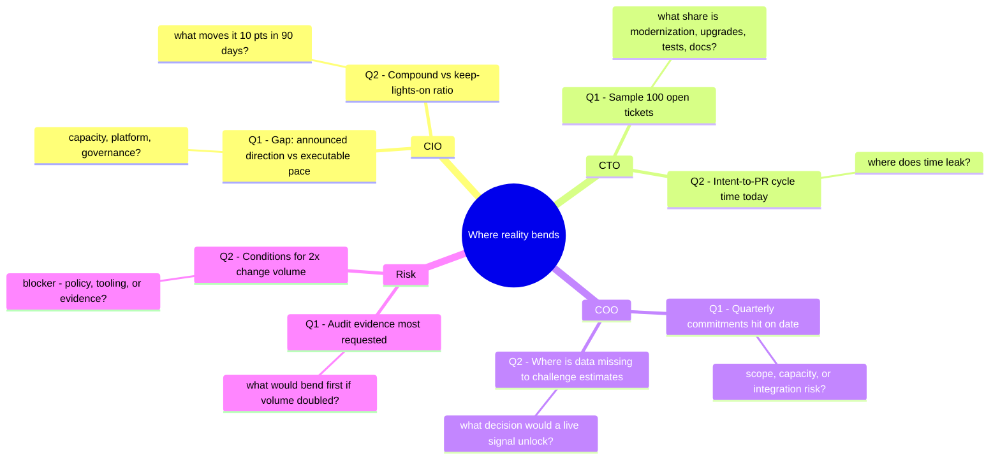

# Discovery map (Panel 3.5)

Four seats at the table. Two questions each. The panel doesn't describe the discovery — it *is* the discovery.

Moderator-side notes (the "what I'm listening for" column) are **not** shown in the microsite; they live here so the person running the conversation has a reading list without breaking the fourth wall.

## Persona map

## What I'm listening for (moderator-side)

| Persona | Question | Signals to listen for | Red flags |
|---|---|---|---|
| **CIO** | Gap between announced cloud/AI direction and executable pace | Naming a specific rate-limiter (hiring pipeline, platform team backlog, governance SLA). Admitting the gap is widening. | Handwave "we're on track". Reframes toward strategy instead of execution. |
| **CIO** | Compound-work vs keep-the-lights-on ratio | Real number (e.g. "70/30 against us"). Explicit wish for "10 pts in 90 days". | No instrumentation. "It depends on the team." |
| **CTO** | 100-ticket modernization / upgrades / tests / docs share | Over ~40 % combined → execution surface is large and addressable. | Under 15 % → either the estate is mature OR the ticket system is hiding the work. |
| **CTO** | Intent → PR-ready cycle time | Specific number with variance ("P50 2w, P90 6w"). Time leak localized (often in review). | "It varies." No P50/P90 culture. |
| **COO** | Quarterly hit rate on commitment date | Below 70 % = predictability problem. Named failure mode (scope / capacity / integration). | "We don't measure that quarterly." |
| **COO** | Missing data to challenge estimates in real time | A specific decision the COO says would unlock (e.g. re-sequencing, early alerts). | Deflects to "that's IT's remit". |
| **Risk** | Audit evidence most requested | Specific control (change tickets, segregation of duties, approval logs). Named time-to-produce. | Generic "we're SOC2-aligned". |
| **Risk** | Conditions for 2× change volume | Willingness to name the bottleneck (policy / tooling / evidence). | Categorical "no" — means the conversation is premature. |

## How to use it live

1. **Pick the seat.** Start with the persona who called the meeting; the others are follow-ups.
2. **Stay on the question.** Two questions per seat is deliberate — resist the urge to preamble.
3. **Capture the number.** Each answer should yield a numeric anchor (cycle time, hit rate, share, time-to-evidence). Without a number, we can't get to Panel 6.5's scale.
4. **Bridge to Panel 4.** "Of the four execution surfaces on the next slide, which one, specifically, would you test first?"

## Source

[`intesa.ts → panel35.personas`](https://github.com/sartan83/DevinTest/blob/devin/1776884377-intesa-executive-microsite/intesa-microsite/src/data/intesa.ts)
