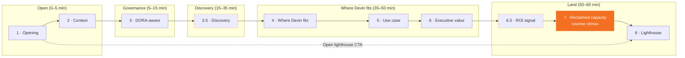

# Intesa Sanpaolo × Devin — Executive microsite wiki

Backstage docs for the microsite in [`intesa-microsite/`](https://github.com/sartan83/DevinTest/tree/devin/1776884377-intesa-executive-microsite/intesa-microsite). The microsite itself is the front-stage conversation tool; this wiki is the cheat-sheet behind the curtain.

Diagrams use GitHub-rendered Mermaid — no build step required.

## Pages

| Page | What it covers |
|---|---|
| [Panels flow](./Panels-flow) | The 10-panel narrative arc, including the two interstitials (`3.5 Discovery`, `6.5 ROI signal`) and the `Open lighthouse` jump. |
| [Counter state](./Counter-state) | Teaser → reveal state machine for the persistent engineering-capacity counter. Includes per-panel `addMin / addMax` assumptions. |
| [ROI model](./Roi-model) | Annualized reclaimed-capacity formula at Intesa scale, Conservative vs. Realistic scenarios, and the Gartner / McKinsey / ISP sources behind them. |
| [Discovery map](./Discovery-map) | CIO / CTO / COO / Risk persona blocks, the two executive questions each, and what to listen for as the moderator. |
| [Compliance framing](./Compliance-framing) | Governance envelope (single-tenant, private connectivity, review gates, audit trail) and the DO / DO NOT phrasing guardrails. |
| [Architecture](./Architecture) | Next.js app structure — `data/intesa.ts` as single source of truth, `MicrositeShell` orchestration, 10 panel components. |

## How the microsite maps to the conversation

## Source of truth

All copy, KPIs, counter assumptions, discovery questions, ROI parameters, and CTAs live in a single file:
[`intesa-microsite/src/data/intesa.ts`](https://github.com/sartan83/DevinTest/blob/devin/1776884377-intesa-executive-microsite/intesa-microsite/src/data/intesa.ts)

Change the narrative → change `intesa.ts`, not the components.
