# Panels flow

The microsite is a 10-tile horizontal snap-scroller on desktop and a vertical snap-stack on phones. Two interstitials (`3.5 Discovery`, `6.5 ROI signal`) reshape the 1–8 spine without breaking it.

## Narrative flow

```mermaid
flowchart LR
  P1["1 · Opening<br/><i>Direction is chosen.<br/>Execution is the constraint.</i>"]
  P2["2 · Context<br/><i>Strategy exists.<br/>Execution is the bottleneck.</i>"]
  P3["3 · DORA-aware governance<br/><i>Speed up without loosening control.</i>"]
  P35["3.5 · Discovery<br/><i>Same constraint,<br/>different seat.</i>"]:::interstitial
  P4["4 · Where Devin fits<br/><i>Four execution surfaces.</i>"]
  P5["5 · Use case<br/><i>Controlled modernization<br/>at scale.</i>"]
  P6["6 · Executive value<br/><i>Trapped capacity<br/>by role.</i>"]
  P65["6.5 · ROI signal<br/><i>~€6–19M / year<br/>at Intesa scale.</i>"]:::interstitial
  P7["7 · Reclaimed capacity<br/><i>≈ 8–18 developer days<br/>(counter climax).</i>"]:::climax
  P8["8 · Lighthouse<br/><i>30-day plan.</i>"]

  P1 --> P2 --> P3 --> P35 --> P4 --> P5 --> P6 --> P65 --> P7 --> P8
  P1 -. "Open lighthouse (secondary CTA)" .-> P8
  P1 -. "Start the discussion (primary CTA)" .-> P2

  classDef interstitial stroke-dasharray: 6 4, stroke:#f36f21, color:#000;
  classDef climax fill:#f36f21, stroke:#f36f21, color:#fff;
```

## Why interstitials

| Panel | Role | Why it's an interstitial (`.5`) |
|---|---|---|
| `3.5 Discovery` | Forces specificity with stakeholder-specific questions (CIO / CTO / COO / Risk). | The Tier-1 conversation must be grounded in the client's reality before any positioning. It runs inside the governance frame (Panel 3) and opens the solution frame (Panel 4+). |
| `6.5 ROI signal` | Annualizes the value at Intesa scale (~3,300 devs) with explicit safety margins. | The session-scoped counter lands `≈ 8–18 developer days`. Panel 6.5 scales that thinking to `~€6–19M / year` before the emotional climax on Panel 7. |

## Navigation

| Gesture | Action |
|---|---|
| `→` `←` `PgDn` `PgUp` | Panel forward / back |
| `Space` | Forward (skipped when a `BUTTON` / `A` has focus — native activation wins) |
| `Home` `End` | Jump to first / last panel |
| Progress-bar dot click | Jump to panel `N` |
| Wheel (desktop) | Vertical wheel → horizontal scroll (handled by `MicrositeShell` wheel listener) |
| Swipe (mobile, ≤ 767 px) | Native vertical snap |

## CTAs

Defined in [`intesa.ts` → `panel1.ctas`](https://github.com/sartan83/DevinTest/blob/devin/1776884377-intesa-executive-microsite/intesa-microsite/src/data/intesa.ts).

| Label | Target (1-indexed render slot) | Lands on |
|---|---|---|
| `Start the discussion` | `2` | Panel 2 · Context |
| `Open lighthouse` | `10` | Panel 8 · Lighthouse |

> **Why `10`, not `8`?** The two interstitials push Panel 8 to render index 9 (10th tile). The data file uses 1-indexed CTA targets (`goTo(target − 1)`), so `target: 10` resolves to `goTo(9)` which is `Panel8Lighthouse`. Regression caught by Devin Review and fixed in commit [`a333df7`](https://github.com/sartan83/DevinTest/commit/a333df7).
