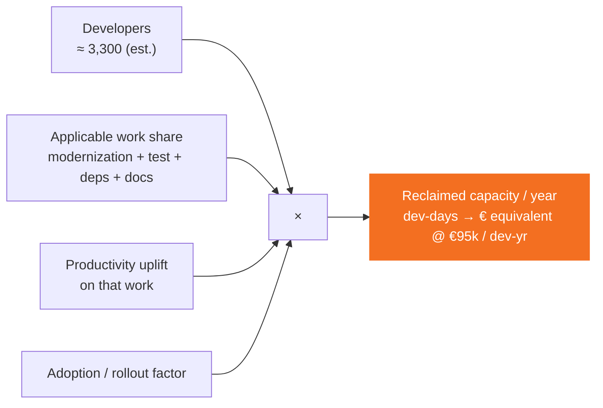

# ROI model (Panel 6.5)

Panel 6.5 scales the per-session `≈ 8–18 developer days` into an **annualized view at Intesa scale**, with the safety margin baked in.

## Formula



```
Reclaimed capacity / year =
  developers × applicable work share × productivity uplift × adoption factor
```

## Baseline

| Parameter | Value | Source / rationale |
|---|---|---|
| Developers | `~3,300` (est.) | Triangulated from ISP press (2,400+ IT hires 2022–25) + Revelio Labs workforce data. |
| Working days / year | `220` | Standard blended (excl. holidays / PTO / training). |
| Fully-loaded cost / dev-year | `~€95,000` | Blended senior / junior, fully-loaded (incl. benefits, infra, tooling allocation). |

## Scenarios

| | **Conservative** (Y1 ramp, heavy safety margin) | **Realistic** (steady-state, mature adoption) |
|---|---|---|
| Applicable work share | 25 % | 30 % |
| Productivity uplift | **15 %** (below McKinsey 20–45 % floor) | **25 %** (middle of McKinsey band) |
| Adoption / rollout | **50 %** (below Gartner 2028 trajectory) | **80 %** (Gartner trajectory, discounted) |
| Reclaimed dev-days / year | `~13,600` | `~43,500` |
| € equivalent / year | `~€5.9M` | `~€18.8M` |

**Headline range presented on the slide:**
> **~€6–19M / year** · `~14k–44k` developer-days / year

## Safety margin

Three layers of conservatism are applied on top of published benchmarks:
1. Productivity uplift capped **below** the McKinsey 20–45 % band (15 % floor).
2. Adoption factor kept **below** the Gartner 2028 adoption trajectory (50 % in conservative).
3. Applicable-work share tied to the **four explicit surfaces** defined on Panel 4 (modernization, test remediation, dependency upgrades, documentation) — not "all engineering hours".

## Sources

| Source | Year | Relevance |
|---|---|---|
| [Gartner — 75% of enterprise software engineers will use AI code assistants by 2028](https://www.gartner.com/en/newsroom/press-releases/2024-04-11-gartner-forecasts-75-percent-of-enterprise-software-engineers-will-use-ai-code-assistants-by-2028) | Apr 2024 | Adoption trajectory anchor. |
| [McKinsey — The economic potential of generative AI](https://www.mckinsey.com/capabilities/mckinsey-digital/our-insights/the-economic-potential-of-generative-ai-the-next-productivity-frontier) | Jun 2023 | Software-engineering task-level productivity uplift 20–45 %. |
| Intesa Sanpaolo press releases & Il Sole 24 Ore | Feb 2026 | `2,400+` IT hires 2022–25, ISYTECH / Isybank modernization roadmap. |

## Compliance note (on the slide itself)

> *Illustrative model, not a commitment. Figures are scenario-level estimates intended to frame a strategic conversation.*

## Where the numbers live

- Data: [`intesa.ts → panel65`](https://github.com/sartan83/DevinTest/blob/devin/1776884377-intesa-executive-microsite/intesa-microsite/src/data/intesa.ts)
- Rendering: [`Panel65RoiSignal.tsx`](https://github.com/sartan83/DevinTest/blob/devin/1776884377-intesa-executive-microsite/intesa-microsite/src/components/panels/Panel65RoiSignal.tsx)

To reframe the pitch, change `applicableWorkPct`, `upliftPct`, `adoptionPct`, `reclaimedDevDays`, `reclaimedEur`, and `headlineRange` in `intesa.ts`. No component code needs to change.
